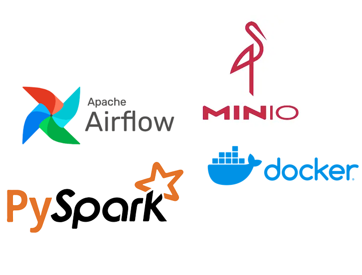

# Spark + Airflow + MinIO Project

This project is a local data engineering environment that uses Apache Spark, Apache Airflow, and MinIO. Data is ingested using a Python script, stored in MinIO, processed with Spark, and orchestrated with Airflow.

## Services
Airflow (webserver, scheduler, Celery workers)

Spark (master and workers)

MinIO (S3-compatible object storage)

## How to Start
docker compose up --build

Airflow Web UI:

http://localhost:8080

# Folder Structure
airflow/       - DAGs, plugins, configs
spark/         - Spark jobs and config
clash_api/     - API ingestion script and raw parquet output
minio/         - Local MinIO storage
docker-compose.yml

